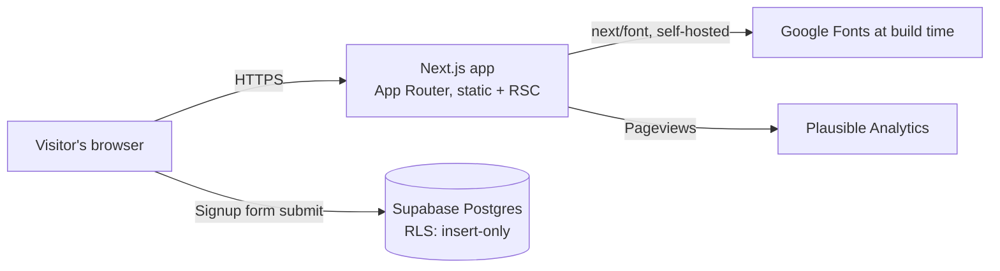

# DRFT — Landing Page

> The AI resume editor that keeps your voice. Marketing site and waitlist capture, built as a single-scroll, single-conversion-goal experience.

[](https://github.com/myekini/DRFT-LPG/actions/workflows/ci.yml)


> **Note:** the CI badge points at `OWNER/REPO` — update it to this repository's actual GitHub path once pushed (`.github/workflows/ci.yml` already runs on every push/PR).

---

## Table of contents

- [Overview](#overview)
- [Features](#features)
- [Tech stack](#tech-stack)
- [Architecture](#architecture)
- [Getting started](#getting-started)
- [Environment variables](#environment-variables)
- [Available scripts](#available-scripts)
- [Quality gates](#quality-gates)
- [Testing](#testing)
- [CI/CD](#cicd)
- [Deployment](#deployment)
- [Security](#security)
- [Accessibility and interaction](#accessibility-and-interaction)
- [Project structure](#project-structure)
- [Content provenance](#content-provenance)
- [Contributing](#contributing)
- [License](#license)

## Overview

This repository holds the public marketing landing page for **DRFT**, an AI-assisted resume editor. It captures early-access email signups into Supabase and is intentionally scoped to one page, one scroll, and one call to action. The page is light-first with a persistent dark theme, uses the supplied DRFT brand kit, and builds its product visuals from DOM/CSS without an animation library.

## Features

- Single-scroll landing page: hero, problem statement, how-it-works, differentiators, open-source note, final CTA
- Animated hero product demo built entirely from CSS/DOM state transitions (no video, no images)
- Two independent waitlist signup forms (hero + final CTA) with accessible live status messaging
- Duplicate-safe email capture via Postgres unique constraint, surfaced as an "already subscribed" success state
- Reduced-motion and no-JS content parity — nothing is gated behind animation support
- SEO/social metadata: `robots.ts`, `sitemap.ts`, and a generated `opengraph-image`

## Tech stack

| Layer            | Choice                                             |
| ----------------- | --------------------------------------------------- |
| Framework         | [Next.js 15](https://nextjs.org) (App Router)      |
| UI                | [React 19](https://react.dev)                      |
| Language          | [TypeScript 5](https://www.typescriptlang.org)     |
| Styling           | [Tailwind CSS v4](https://tailwindcss.com)         |
| Icons             | [lucide-react](https://lucide.dev)                 |
| Fonts             | Geist, Instrument Serif (self-hosted via `next/font`) |
| Data              | [Supabase](https://supabase.com) (Postgres + RLS)  |
| Analytics         | [Plausible](https://plausible.io)                  |
| Testing           | Node's built-in test runner (`node:test`) via `tsx` |
| Linting           | ESLint 9 (flat config, `eslint-config-next`)       |
| Visual QA         | Playwright (`scripts/browser-check.mjs`)           |
| CI                | GitHub Actions                                     |

## Architecture



The page is fully statically generated at build time (`○` routes in the build output). The only runtime network call from the client is the direct-to-Supabase insert issued by the waitlist forms — there is no custom backend/API route in between.

## Getting started

### Prerequisites

- Node.js `>= 20.9.0` (see [`.nvmrc`](.nvmrc))
- npm (ships with Node)
- A [Supabase](https://supabase.com) project

### Installation

```bash
npm install
cp .env.example .env.local   # then fill in your Supabase project URL and anon key
```

Apply the schema once in the Supabase SQL editor:

```bash
# paste the contents of supabase/schema.sql into the SQL editor and run it
```

### Run locally

```bash
npm run dev
```

Opens the dev server at [http://localhost:3000](http://localhost:3000).

## Environment variables

Copy [`.env.example`](.env.example) to `.env.local` and fill in the values below.

| Variable                        | Required | Description                                                              |
| -------------------------------- | -------- | -------------------------------------------------------------------------- |
| `NEXT_PUBLIC_SUPABASE_URL`       | Yes      | Supabase project URL.                                                    |
| `NEXT_PUBLIC_SUPABASE_ANON_KEY`  | Yes      | Supabase **public anon/publishable** key. Never use a service-role key.  |
| `NEXT_PUBLIC_WAITLIST_COUNT`     | No       | Displays a verified signup count. Leave blank rather than faking a number. |
| `NEXT_PUBLIC_TWITTER_URL`        | No       | Enables the footer Twitter/X link.                                       |
| `NEXT_PUBLIC_CONTACT_EMAIL`      | No       | Enables the footer contact link.                                         |

All variables are `NEXT_PUBLIC_*` by design — this page has no server-side secrets.

## Available scripts

| Script                | Purpose                                                                 |
| ---------------------- | -------------------------------------------------------------------------- |
| `npm run dev`          | Start the Next.js development server.                                   |
| `npm run build`        | Production build. Runs `prebuild` first (typecheck → lint → tests), then `next build`. |
| `npm start`            | Serve the production build (`npm run build` must run first).            |
| `npm run lint`         | Run ESLint (`eslint .`).                                                 |
| `npm run typecheck`    | Run `tsc --noEmit`.                                                      |
| `npm test`             | Run unit tests (`node:test` via `tsx`).                                 |
| `npm run verify`       | Run typecheck, lint, tests, and a full build in one command.            |

## Quality gates

`npm run build` is the single command that gives production-readiness confidence: it wires a `prebuild` hook that runs, in order, **typecheck → lint → unit tests**, and only then runs `next build`. If any gate fails, the build stops before producing output.

```bash
npm run build
```

Run `npm run verify` for the same set of gates without the `npm run`/`npm start` split — useful as a single pre-push sanity check.

## Testing

Unit tests cover the waitlist signup service (`lib/supabase.ts`) with mocked network responses — invalid email handling, missing configuration, success, duplicate-email, and service-failure paths.

```bash
npm test
```

For a full visual/interaction smoke test against a running dev server (desktop/tablet/mobile screenshots, overflow checks, form and hero-demo interaction), see [`scripts/browser-check.mjs`](scripts/browser-check.mjs) (requires `npm run dev` running separately and Microsoft Edge installed):

```bash
node scripts/browser-check.mjs
```

## CI/CD

[`.github/workflows/ci.yml`](.github/workflows/ci.yml) runs on every push and pull request to `main`: installs dependencies with `npm ci`, then runs `npm run build`, which itself gates on typecheck, lint, and tests before building. Update the CI badge at the top of this file with your repository's actual `OWNER/REPO` once this project is pushed to GitHub.

## Deployment

- Deploy to any Next.js-compatible host (e.g. Vercel). Configure environment variables **before** building.
- Apply `supabase/schema.sql` to the target Supabase project before go-live.
- Only ever expose the public anon/publishable Supabase key to the client; never the service-role key.
- Set provider-level rate limiting or CAPTCHA before a high-volume campaign — the Supabase insert endpoint is reachable directly from the client.
- Configure the `drft.io` site in Plausible before launch.
- The build fetches Instrument Serif from Google Fonts at build time and self-hosts it in production — the build environment needs network access to Google Fonts.

## Security

- **Row Level Security (RLS)** is enabled on `public.waitlist`; the `anon`/`authenticated` roles are granted `INSERT` only — there is no public `SELECT` policy, so subscriber emails are never publicly readable.
- Email input is validated and normalized (lowercased, trimmed, length- and format-checked) both client-side and via a Postgres `check` constraint.
- Duplicate signups are detected via a unique constraint (`23505`) and surfaced as a normal success state rather than an error. This is a UX choice, not an anti-enumeration control — an attacker can still probe arbitrary addresses via the public insert endpoint, so pair with rate limiting or CAPTCHA in production.
- Missing configuration, network errors, and request timeouts (`AbortSignal.timeout`) all fail closed — none of them can produce a false "success" state.

## Accessibility and interaction

- Both signup forms hold independent state and expose live, accessible status messaging (`aria-busy`, `aria-invalid`, status text).
- The hero product demo loops on a cleaned-up timer sequence; **Accept**/**Revert** stop the loop, **Replay** restarts it.
- `prefers-reduced-motion` and a manual pause control both show a static, completed edit state instead of looping.
- All content is available without scroll-triggered animation support.
- Mobile hides the demo's chat panel and stacks forms/features vertically.

## Project structure

```text
app/            Next.js App Router routes, layout, and global styles
app/styles/     Supplied theme and design-token CSS imported by globals.css
components/     Page section and UI components
lib/            Client/service helpers (Supabase)
supabase/       Database schema
scripts/        Dev-only tooling (Playwright browser check)
tests/          Unit tests
docs/           Product spec and design-system reference docs
.github/        CI workflow definitions
```

## Content provenance

- The pasted build brief takes precedence over the older spec in [`docs/`](docs) where they conflict (radii, timings, copy, responsive breakpoints).
- The two named inspiration markdown files referenced in the original brief were never supplied.
- Product performance and licensing statements in the copy are supplied marketing claims, not independently verified measurements.
- Signup persistence requires a correctly configured Supabase project — there is no fallback storage.
- Production LCP/INP figures require deployed-device measurement; none are claimed here.

## Contributing

1. Create a branch from `main`.
2. Run `npm run verify` before opening a pull request — CI runs the same gate.
3. Keep the page's scope intentional: one scroll, one conversion goal, no images or animation libraries.

## License

Proprietary — all rights reserved. No license is currently granted for reuse; contact the maintainers before redistributing any part of this codebase.
